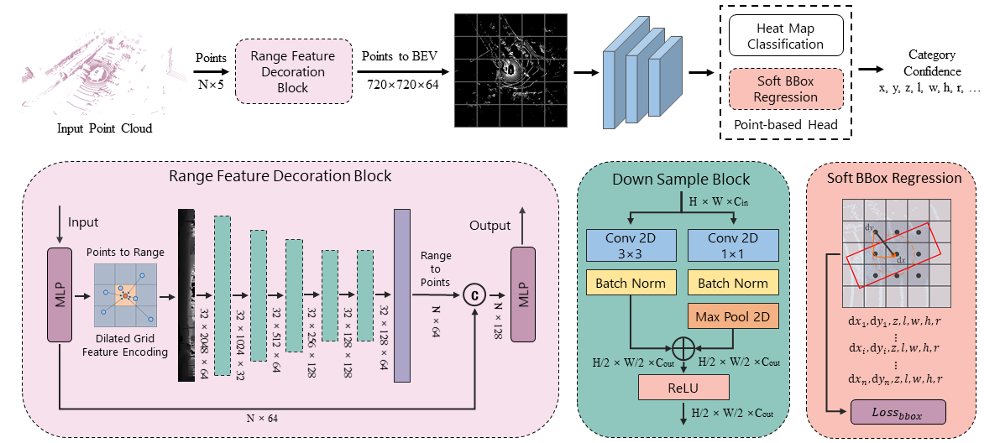

# RFDNet

> Paper of **RFDNet: Real-Time 3D Object Detection via Range Feature Decoration**

<p align="center">  </p>

    @inproceedings{chang2023rdnet,
        author = {Chang, Hongda and Wang, Lu and Cheng, Jun },
        title = {RFDNet: Real-Time 3D Object Detection via Range Feature Decoration},
        booktitle = {2023 IEEE/RSJ International Conference on Intelligent Robots and Systems (IROS)},
        year = {2023}
    }

## Abstract

High-performance real-time 3D object detection is crucial in autonomous driving perception systems. Voxel- or point-based 3D object detectors are highly accurate but inefficient and difficult to deploy, while other methods use 2D projection views to improve efficiency, but information loss usually degrades performance. To balance effectiveness and efficiency, we propose a scheme called RFDNet that uses range features to decorate points. Specifically, RFDNet adaptively aggregates point features projected to independent grids and nearby regions via Dilated Grid Feature Encoding (DGFE) to generate a range view, which can handle occlusion and multi-frame inputs while the established geometric correlation between grid with surrounding space weakens the effects of scale distortion. We also propose a Soft Box Regression (SBR) strategy that supervises 3D box regression on a more extensive range than conventional methods to enhance model robustness. In addition, RFDNet benefits from our designed Semantic-assisted Ground-truth Sample (SA-GTS) data augmentation, which additionally considers collisions and spatial distributions of objects. Experiments on the nuScenes benchmark show that RFDNet outperforms all LiDAR-only non-ensemble 3D object detectors and runs at high speed of 20 FPS, achieving a better effectiveness-efficiency trade-off.

## Quick Start

### Installation

```shell
pip install -U openmim
mim install mmengine
mim install 'mmcv>=2.0.0rc4'
mim install 'mmdet>=3.0.0'
pip install -v -e .
```

### Start Training

1. Prepare the nuScenes data to the `data/nuscenes` directory, the directory structure should be as follows:

```
├── configs
├── data
│   └── nuscenes
├── docs
├── mmdet3d
├── requirements
├── tools
├── utils
│   ......
```

2. Data preprocessing

```shell
python tools/preprocess/nuscenes_preprocess.py --dataroot ./data/nuscenes --version v1.0-trainval --max-sweeps 10 --with_lidarseg
```

3. Execute the following command to start training with 4 device

```shell
bash train.sh "0,1,2,3" "rfdnet_naive+dgfe+sbr+sagts" 4
```
